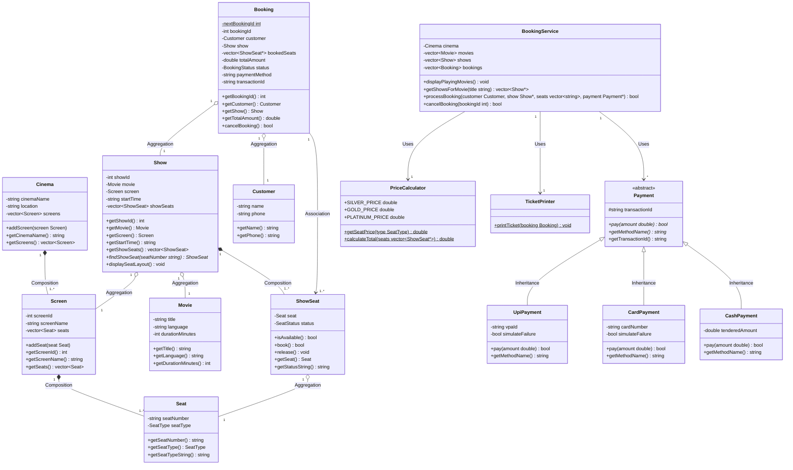

# TCS-504 Assignment 1: Movie Ticket Booking System
**Course**: B.Tech. Computer Science & Engineering (Semester V)  
**Subject**: System Design  
**Subject Code**: TCS-504  
**Submission Date**: 07-September-2026  
**System Name**: Menu-Driven Single Cinema Movie Ticket Booking System  

---

## Executive Summary

This document presents the complete architectural design, object-oriented analysis, UML modeling, and modular C++ implementation of a menu-driven **Movie Ticket Booking System** for a single cinema (PVR / INOX). Built to fulfill the exact academic requirements of TCS-504 (Assignment 1), the system implements mandatory functional features including date/show selection, tier-based pricing (Silver: ₹150, Gold: ₹250, Platinum: ₹400), seat matrix availability management, multi-channel payment processing (UPI, Card, Cash), itemized ticket rendering, and booking cancellation.

The implementation adheres to strict Clean Code principles, zero header file constraints ("One class per file, no header files"), SOLID design patterns, and explicitly demonstrates ten fundamental Object-Oriented Programming (OOP) concepts in C++17.

---

## Section A: Requirement Analysis (Step A)

### 1. Functional Requirements (FR)

| Requirement ID | Title | Detailed Specification |
|---|---|---|
| **FR1** | List Currently Playing Movies | The system shall display a complete list of all currently playing movies with title, language, and duration. |
| **FR2** | List Shows for Movie | The system shall allow the user to select a movie and display all associated screenings including screen name/number and start time. |
| **FR3** | Display Seat Layout | The system shall render the seat layout matrix for a selected show, indicating seat number, tier (Silver/Gold/Platinum), and current status (`AVAILABLE` or `BOOKED`). |
| **FR4** | Book Seat(s) & Validate | The system shall accept booking requests for one or more seats. If any requested seat is already `BOOKED`, the system must reject the transaction without altering state. |
| **FR5** | Tiered Price Calculation | The system shall compute total cost according to fixed seat pricing: **SILVER** = ₹150, **GOLD** = ₹250, **PLATINUM** = ₹400. |
| **FR6** | Multi-Channel Payment | The system shall support payment via UPI, Credit/Debit Card, or Cash. If payment fails or is declined, the booking must NOT be confirmed and seats must remain available. |
| **FR7** | Print Pass / Ticket | Upon successful payment, the system shall format and print an itemized movie ticket pass containing unique Booking ID, movie, screen, start time, seat numbers, payment details, and total amount paid. |
| **FR8** | Booking Cancellation | The system shall permit users to cancel a confirmed booking using their Booking ID, reverting all associated seats back to `AVAILABLE` status. |

### 2. Non-Functional Requirements (NFR)

1. **NFR1: Modularity (One Class per File)**: The system codebase must be structured into independent single-class `.cpp` files with zero header files, strictly enforcing modular encapsulation.
2. **NFR2: Extensibility (Open-Closed Principle)**: The architecture must allow adding new payment channels (e.g., `NetBankingPayment`) by creating a new derived class without modifying existing `BookingService` or `Payment` abstractions.
3. **NFR3: Robust Error Handling & Input Validation**: The system must validate all user input (invalid seat numbers, non-numeric menu choices) gracefully, displaying clear error messages without crashing or corrupting memory state.
4. **NFR4: Data Integrity & State Consistency**: The system must enforce atomic transaction semantics during booking. Seats must only transition from `AVAILABLE` to `BOOKED` after payment authorization is verified.

---

## Section B: Noun–Verb Analysis (Step B)

### 1. Problem Statement Text Extraction

> *"A customer browses currently playing movies at a cinema multiplex, chooses a movie show screening on a screen at a specific start time, inspects seat availability in the auditorium layout, selects one or more seats, calculates the total price based on seat tiers (Silver, Gold, Platinum), makes a payment through UPI, Card, or Cash, receives a printed movie ticket containing a unique booking ID, or cancels an existing booking to release seats back to available status."*

### 2. Extracted Nouns & Verbs

- **Nouns**: Customer, Movie, Cinema, Multiplex, Show, Screening, Screen, Time, Seat, Availability, Auditorium, Layout, Tier, Price, Payment, UPI, Card, Cash, Ticket, Booking ID, Status.
- **Verbs**: Browses, Displays, Chooses, Inspects, Selects, Calculates, Pays, Prints, Receives, Cancels, Releases, Validates.

### 3. Class Candidate Matrix & Rejected Nouns Justification

| Noun Found | Keep as a Class? | Reason / Decision & Justification |
|---|---|---|
| `Movie` | **Yes** | Has its own data (title, language, duration) and identity. |
| `Seat` | **Yes** | Has number, type (SILVER/GOLD/PLATINUM), and price. |
| *"seat layout"* | **No** | It is a view of a Show's seats, not a physical thing → a display/print method in `Show`. |
| `Screen` | **Yes** | Represents one auditorium; screen number and owns its physical seats. |
| `Cinema` | **Yes** | Represents the theatre multiplex; name and owns its screens. |
| `Show` | **Yes** | Represents one screening (Movie on a Screen at a time); owns its ShowSeats. |
| `ShowSeat` | **Yes** | Represents the status of ONE seat FOR ONE show (`AVAILABLE` / `BOOKED`). |
| `Customer` | **Yes** | Represents identity of customer (name and phone number). |
| `Booking` | **Yes** | Transaction record storing booking ID, which show, which seats, total amount, status. |
| `Payment` | **Yes (Abstract)** | Abstract payment contract defining `pay(amount)` pure virtual method. |
| `UpiPayment` | **Yes** | Concrete derived class implementing UPI payment gateway strategy. |
| `CardPayment` | **Yes** | Concrete derived class implementing Card payment gateway strategy. |
| `CashPayment` | **Yes** | Concrete derived class implementing Cash payment strategy. |
| `PriceCalculator` | **Yes** | Service class responsible for turning a list of seats into a total amount. |
| `TicketPrinter` | **Yes** | Service class responsible for formatting and printing tickets (printing only). |
| `BookingService` | **Yes** | Orchestrator class running the booking flow end-to-end. |
| `MainMenu` | **Yes** | Boundary class managing console menu and input reading. |
| *Multiplex* | **No** | Synonym for `Cinema`; duplicate concept. |
| *Screening / Time* | **No** | Represented as primitive attributes (`startTime`) inside `Show`. |
| *Auditorium* | **No** | Structural auditorium entity represented directly by `Screen`. |
| *Tier / Price* | **No** | Enum (`SeatType`) and price calculated dynamically by `PriceCalculator`. |
| *Booking ID* | **No** | Primitive static auto-incrementing counter/attribute within `Booking` class. |

---

## Section C: Class Responsibility Breakdown (Step C: Knows / Does / Must NOT Do)

For every required class, its ONE primary responsibility and 3-part scope are demarcated below:

| Class Name | Primary Responsibility | What It Knows | What It Does | What It Must NOT Do |
|---|---|---|---|---|
| **`Movie`** | Movie metadata identity. | Title, language, duration (minutes). | Provides getters for title, language, and duration. | Manage showtimes, calculate prices, or track bookings. |
| **`Seat`** | One physical seat. | Seat number (e.g., "S1") and type (`SILVER`/`GOLD`/`PLATINUM`). | Provides getters for seat number, tier enum, and tier label/price. | Track per-show booking status or handle payments. |
| **`Screen`** | One auditorium; owns seats. | Screen number/ID, screen name, owned physical `Seat`s. | Manages physical seat list (`addSeat`) and returns seat collection. | Schedule movie shows or manage customer transactions. |
| **`Cinema`** | The theatre multiplex. | Cinema name, location, owned `Screen` auditoriums. | Manages screens (`addScreen`) and returns cinema details. | Execute booking logic or print ticket passes. |
| **`Show`** | One screening (Movie on Screen at Time). | Show ID, `Movie` ref, `Screen` ref, start time, owned `ShowSeat`s. | Initializes per-show seat matrix, finds seat by number, displays layout. | Process payment transactions or calculate total bills. |
| **`ShowSeat`** | Status of ONE seat FOR ONE show. | Physical `Seat` ref, status (`AVAILABLE` / `BOOKED`). | Checks availability, marks booked (`book()`), releases seat (`release()`). | Compute ticket prices or store customer profiles. |
| **`Customer`** | Customer identity. | Customer name and phone number. | Provides accessors for name and phone. | Manage seat layouts or validate payment methods. |
| **`Booking`** | Booking transaction record. | Booking ID (static increment), `Customer`, `Show`, booked `ShowSeat`s, total amount, status. | Stores transaction data, provides getters, handles cancellation (`cancelBooking()`). | Prompt user CLI input or invoke external payment gateways directly. |
| **`Payment` (abstract)** | Payment interface contract. | Transaction ID string (protected). | Defines pure virtual interface (`pay(amount)`, `getMethodName()`). | Be instantiated directly or contain UI rendering logic. |
| **`UpiPayment`** | UPI payment execution. | VPA ID (`user@bank`), failure flag. | Overrides `pay()` for UPI, validates VPA, generates txn ID. | Store seat selection or manipulate booking records. |
| **`CardPayment`** | Card payment execution. | Card number, failure flag. | Overrides `pay()` for Card, validates card number, generates txn ID. | Calculate tier pricing or manage movie lists. |
| **`CashPayment`** | Cash payment execution. | Tendered cash amount. | Overrides `pay()` for Cash, validates tendered amount against bill. | Handle online digital signatures or bank API calls. |
| **`PriceCalculator`** | Seat list cost calculation. | Price constants (Silver ₹150, Gold ₹250, Platinum ₹400). | Turns list of selected seats into total bill amount. | Maintain state, alter seat status, or process payments. |
| **`TicketPrinter`** | Pass ticket formatting & printing. | Nothing (stateless static utility). | Formats and prints itemized ticket pass to console (`printTicket()`). | Modify booking status, authorize payments, or prompt user input. |
| **`BookingService`** | End-to-end flow orchestrator. | System `Cinema`, collections of `Movie`s, `Show`s, and `Booking`s. | Orchestrates booking workflow (`processBooking()`), seat validation, and cancellations. | Parse raw CLI inputs or embed hardcoded gateway payment logic. |
| **`MainMenu`** | Console menu & input reading. | Reference to `BookingService`. | Displays CLI menu [1-7], reads/validates user inputs, invokes verifier. | Perform seat state mutations directly or calculate ticket costs. |

---

## Section D: Relationships & Lifetime Test (Step D)

Every relationship between system components is categorized below and strictly justified using the **Object Lifetime Test**: *"If the whole (parent) object is destroyed, does the part (associated) object continue to exist independently?"*

| Pair | Your Choice | Your Justification (Object Lifetime Test) |
|---|---|---|
| **Cinema — Screen** | **Composition** (`◆`) | Physical auditoriums (`Screen`) are built inside the `Cinema`. If the `Cinema` building is demolished/destroyed, the screens inside cease to exist. |
| **Screen — Seat** | **Composition** (`◆`) | Physical seats belong exclusively to a specific auditorium `Screen`. Destroying the `Screen` auditorium destroys all physical seats inside it. |
| **Show — Movie** | **Aggregation** (`◇`) | A `Show` references a `Movie`. If the scheduled `Show` is cancelled or deleted, the `Movie` catalog entry continues to exist independently. |
| **Show — Screen** | **Aggregation** (`◇`) | A `Show` takes place inside a `Screen`. Cancelling the `Show` does not destroy the physical auditorium `Screen`. |
| **Show — ShowSeat** | **Composition** (`◆`) | `ShowSeat` instances represent per-show seat availability state. If the `Show` screening is deleted, its per-show seat states cease to exist. |
| **Booking — Customer** | **Aggregation** (`◇`) | A `Booking` belongs to a `Customer`. Cancelling or deleting the `Booking` record does not delete the `Customer` profile. |
| **Booking — ShowSeat** | **Association** (`──▶`) | `Booking` maintains pointers to selected `ShowSeat`s to reflect state changes. Destroying a booking record releases the seats without destroying the seat objects. |
| **Booking — Payment** | **Association** (`──▶`) | `Booking` interacts with a `Payment` object to verify transaction completion; neither owns the lifetime of the other. |
| **Payment — UpiPayment** | **Inheritance** (`──▷`) | `UpiPayment` *is-a* specialized type of `Payment` inheriting its abstract contract (`pay()`). |
| **BookingService — Booking** | **Composition / Aggregation** (`◆` / `◇`) | `BookingService` manages the lifecycle of `Booking` collections in memory during system execution. |

---

## Section E: Class Diagram (Step E)



---

## Section F: Sequence Diagram (Step F)

Use Case: **Customer books one seat and pays using UPI.**

```mermaid
sequenceDiagram
    autonumber
    actor C as Customer
    participant BS as BookingService
    participant S as Show
    participant SS as ShowSeat
    participant PC as PriceCalculator
    participant P as UpiPayment
    participant B as Booking
    participant TP as TicketPrinter

    C->>BS: processBooking(customer, showId=101, seat=["S1"], paymentPtr)
    activate BS
    
    BS->>S: findShowSeat("S1")
    activate S
    S-->>BS: return ShowSeat* pointer
    deactivate S

    BS->>SS: isAvailable()
    activate SS
    SS-->>BS: return true (AVAILABLE)
    deactivate SS

    BS->>PC: calculateTotal([ShowSeat*])
    activate PC
    PC-->>BS: return totalAmount = ₹150.00
    deactivate PC

    BS->>P: pay(150.00)
    activate P
    Note over P: Validates VPA & processes transaction
    P-->>BS: return paymentSuccess = true (Txn ID: UPI-TXN-109212)
    deactivate P

    BS->>SS: book()
    activate SS
    Note over SS: State updated to BOOKED
    SS-->>BS: return true
    deactivate SS

    create participant B
    BS->>B: «create» Booking(customer, show, seats, 150.00, "UPI", "UPI-TXN-109212")
    activate B
    B-->>BS: Booking object created (Booking ID: #1001)
    deactivate B

    BS->>TP: printTicket(booking)
    activate TP
    Note over TP: Formats & renders pass on console
    TP-->>BS: return void
    deactivate TP

    BS-->>C: Booking Confirmed (#1001)
    deactivate BS
```

---

## Section G: Modular Code & Edge-Case Verification (Step G)

### 1. C++ Source Code Structure

The implementation consists of 17 modular `.cpp` files with **no header files**:
- `src/Movie.cpp`: Pure movie entity.
- `src/Seat.cpp`: Physical seat & tier enum.
- `src/Screen.cpp`: Auditorium owning seats via composition.
- `src/Cinema.cpp`: Cinema entity owning screens.
- `src/ShowSeat.cpp`: State wrapper tracking seat status per show.
- `src/Show.cpp`: Screening details & layout renderer.
- `src/Customer.cpp`: Customer details model.
- `src/Payment.cpp`: Abstract base payment class.
- `src/UpiPayment.cpp`: UPI payment implementation.
- `src/CardPayment.cpp`: Card payment implementation.
- `src/CashPayment.cpp`: Cash payment implementation.
- `src/PriceCalculator.cpp`: Single responsibility pricing engine.
- `src/TicketPrinter.cpp`: Itemized pass ticket renderer.
- `src/Booking.cpp`: Booking record with static ID counter.
- `src/BookingService.cpp`: Core business orchestrator.
- `src/MainMenu.cpp`: User interface menu & automated verifier.
- `src/main.cpp`: Main execution entry point.

### 2. Compilation Command

```bash
C:\mingw64\bin\g++.exe -std=c++17 -O2 -static -I. src/main.cpp -o main.exe
```

### 3. Execution Verification Transcript (`.\main.exe --demo`)

```text
==================================================
   RUNNING AUTOMATED MANDATORY EDGE-CASE DEMO    
==================================================

--- DEMO TEST 1: Successful Booking via UPI (F1-F7) ---
[PRICE CALCULATOR] Total cost: Rs. 400
[UPI Payment] Processing Rs. 400 via VPA: alice@okaxis
[UPI Payment SUCCESS] Txn ID: UPI-TXN-109212
[BOOKING SUCCESS] Booking #1001 confirmed!

==================================================
               MOVIE TICKET PASS                  
==================================================
 Booking ID  : #1001
 Status      : CONFIRMED
 Customer    : Alice Sharma (9876543210)
--------------------------------------------------
 Movie       : Inception (English)
 Screen      : Auditorium 1 (IMAX 3D)
 Time        : 14:30 PM
--------------------------------------------------
 Seats       : S1 (SILVER), G1 (GOLD)
--------------------------------------------------
 Payment     : UPI (alice@okaxis)
 Txn ID      : UPI-TXN-109212
 Total Paid  : Rs. 400.00
==================================================


--- DEMO TEST 2: Edge Case 1 - Booking Already Booked Seat (Rejection) ---
[BOOKING REJECTED] Seat 'S1' is already BOOKED!

--- DEMO TEST 3: Edge Case 2 - Failed Payment Handling (No Confirmation) ---
[PRICE CALCULATOR] Total cost: Rs. 400.00
[UPI Payment] Processing Rs. 400.00 via VPA: bob_invalid_vpa
[UPI Payment FAILED] Invalid VPA or bank decline!
[BOOKING FAILED] Payment failed! Booking NOT confirmed.

--- DEMO TEST 4: Edge Case 3 - Booking Cancellation & Seat Recovery (F8) ---
[SUCCESS] Booking #1001 cancelled. Seats released.

==========================================
 SEAT LAYOUT FOR SHOW #101 (Inception)
 Screen: Auditorium 1 (IMAX 3D) | Time: 14:30 PM
==========================================
Seat  S1 [  SILVER] : [AVAILABLE]
Seat  S2 [  SILVER] : [AVAILABLE]
Seat  G1 [    GOLD] : [AVAILABLE]
Seat  G2 [    GOLD] : [AVAILABLE]
Seat  P1 [PLATINUM] : [AVAILABLE]
Seat  P2 [PLATINUM] : [AVAILABLE]
==========================================

--- DEMO TEST 5: Booking Seat S1 after Cancellation ---
[PRICE CALCULATOR] Total cost: Rs. 150.00
[Card Payment] Processing Card ending in 6789 for Rs. 150.00
[Card Payment SUCCESS] Txn ID: CRD-TXN-100222
[BOOKING SUCCESS] Booking #1002 confirmed!

==================================================
               MOVIE TICKET PASS                  
==================================================
 Booking ID  : #1002
 Status      : CONFIRMED
 Customer    : Bob Verma (9123456789)
--------------------------------------------------
 Movie       : Inception (English)
 Screen      : Auditorium 1 (IMAX 3D)
 Time        : 14:30 PM
--------------------------------------------------
 Seats       : S1 (SILVER)
--------------------------------------------------
 Payment     : Card
 Txn ID      : CRD-TXN-100222
 Total Paid  : Rs. 150.00
==================================================
```

---

## Section H: SOLID & OOP Mapping (Step H)

### 1. Mapping of 10 Required OOP Concepts

1. **Encapsulation**: Implemented in all entity classes (`Movie`, `Seat`, `Show`, `Customer`, `Booking`) by declaring attributes as `private` and exposing access exclusively via getter/setter methods.
2. **Abstraction**: Implemented in `Payment.cpp` by declaring pure virtual functions `virtual bool pay(double amount) = 0`, hiding low-level gateway execution details from high-level services.
3. **Inheritance**: Implemented by `UpiPayment`, `CardPayment`, and `CashPayment` inheriting publicly from the `Payment` base class.
4. **Runtime Polymorphism**: Demonstrated in `BookingService::processBooking()` where `Payment* paymentMethod` dynamically invokes the overridden `pay()` method corresponding to the concrete derived object at runtime.
5. **Compile-Time Polymorphism**: Demonstrated through constructor method overloading in `Movie`, `Seat`, `Screen`, and `Show` classes.
6. **Static Members**: Demonstrated in `Booking.cpp` via static variable `int Booking::nextBookingId`, used to auto-generate unique global booking IDs across instances.
7. **`this` Keyword**: Explicitly used in constructors across `Movie.cpp`, `Seat.cpp`, `Screen.cpp`, and `Cinema.cpp` to disambiguate parameter names from member variable attributes.
8. **Composition**: Demonstrated in `Screen — Seat` and `Show — ShowSeat` where child seat instances are tightly owned and lifecycle-managed by their containers.
9. **Aggregation**: Demonstrated in `Show — Movie` and `Booking — Customer` where referenced objects exist independently outside the owner's lifecycle.
10. **Association**: Demonstrated in `BookingService` interacting with `PriceCalculator`, `TicketPrinter`, and `Payment` to complete transactions.

### 2. Application of SOLID Principles

- **Single Responsibility Principle (SRP)**: Separated distinct concerns into standalone classes: `PriceCalculator` handles pricing only, `TicketPrinter` handles pass output formatting only, `BookingService` handles orchestration only, and `Payment` handles transaction execution.
- **Open-Closed Principle (OCP)**: The system is open for expansion but closed for modification. Adding a new payment provider (e.g., `NetBankingPayment`) requires creating a new subclass of `Payment` without modifying `BookingService` or `TicketPrinter`.
- **Liskov Substitution Principle (LSP)**: Any subclass of `Payment` (`UpiPayment`, `CardPayment`, `CashPayment`) can be passed to `BookingService::processBooking()` via `Payment*` without breaking execution logic.
- **Interface Segregation Principle (ISP)**: The `Payment` interface defines only essential payment capabilities (`pay()`, `getMethodName()`), avoiding bloated methods like refunds or credit score checks that concrete payment types may not support.
- **Dependency Inversion Principle (DIP)**: `BookingService` depends on the high-level `Payment` abstraction rather than hardcoding concrete dependencies on `UpiPayment` or `CardPayment`.

### 3. Deliberately Un-implemented Design Decision

> **Design Decision**: The system deliberately **does NOT implement a persistent SQL/NoSQL database layer or file-based serialization**.
> 
> **Rationale**: To adhere strictly to assignment Scope Constraint #2 (*"Build a small movie ticket booking system for a single cinema... build exactly this, nothing more"*), data state is maintained in-memory for the duration of the CLI session. Adding external database drivers (e.g., SQLite/MySQL C++ Connector) would introduce heavy external binary dependencies without contributing to the core academic OOP evaluation objectives.
